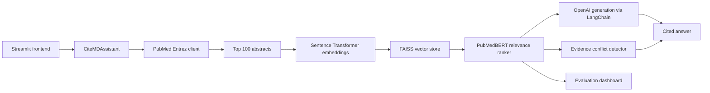

# CiteMD

CiteMD is a PubMed Copilot: a Streamlit application that searches PubMed, retrieves abstracts, ranks paper relevance, and generates cited biomedical answers with supporting evidence.

## Architecture



## What is included

- PubMed Entrez search and abstract retrieval.
- FAISS-backed RAG retrieval with a deterministic local embedding fallback.
- PyTorch Dataset/DataLoader and Hugging Face Trainer pipeline for PubMedBERT relevance ranking.
- LangChain/OpenAI answer generation with inline PMID citations.
- Supporting citations, retrieved papers, ranking scores, and confidence display.
- Simple evidence conflict detector for opposing abstract conclusions.
- Retrieval, ranking, and RAGAS evaluation scripts.
- Unit tests for retrieval fallback, ranking fallback, conflict detection, and metrics.

## Project structure

```text
frontend/      Streamlit UI
backend/       Retrieval, ranking, generation, and orchestration services
models/        Model factory helpers and fine-tuned model output path
training/      Weak supervision data creation and PubMedBERT fine-tuning
evaluation/    Retrieval and generated-answer evaluation
data/          Local datasets, qrels, and vector artifacts
notebooks/     Experiment notebooks
tests/         Unit tests
```

## Setup

```bash
python -m venv .venv
source .venv/bin/activate
pip install -r requirements.txt
cp .env.example .env
```

Set `PUBMED_EMAIL` to a real email address. Set `OPENAI_API_KEY` to enable generated answers. Without OpenAI, CiteMD still runs and returns an extractive evidence summary. PubMed access uses Biopython when installed and falls back to a standard-library Entrez client in lean environments.

Create a local `.env` file:

```bash
cp .env.example .env
```

Then set:

```text
OPENAI_API_KEY=sk-...
```

## Run the app

```bash
streamlit run frontend/app.py
```

Open `http://localhost:8501`.

If you are using the project virtual environment created during setup:

```bash
.venv/bin/streamlit run frontend/app.py --server.fileWatcherType none
```

## Run as a PubMed copilot extension

CiteMD can also run as a local browser extension that injects a panel directly into PubMed and Google Scholar pages.

Start the local API:

```bash
.venv/bin/uvicorn backend.api:app --host 127.0.0.1 --port 8001
```

Then install the extension:

1. Open `chrome://extensions` or `edge://extensions`.
2. Turn on Developer mode.
3. Click Load unpacked.
4. Select the `extension` directory in this project.
5. Open `https://pubmed.ncbi.nlm.nih.gov` or `https://scholar.google.com` and click the CiteMD button.

The extension calls the local API, so keep the API running while you browse. On Google Scholar pages, CiteMD uses the visible Scholar result titles, snippets, metadata, and links as page context while still retrieving PubMed literature in the backend.

## Train the PubMedBERT ranker

Create weak labels from PubMed search results. Top results for the query are positives; papers from unrelated queries are negatives.

```bash
python -m training.weak_labels \
  --query "pancreatic cancer treatment" \
  --output data/weak_ranker_dataset.jsonl \
  --positives 50 \
  --negatives 50

python -m training.train_ranker \
  --train-file data/weak_ranker_dataset.jsonl \
  --output-dir models/pubmedbert-ranker \
  --epochs 2 \
  --batch-size 8
```

The app automatically uses `models/pubmedbert-ranker` when present. If no fine-tuned model exists, it uses a lexical relevance fallback rather than an untrained classifier. This workspace includes a small weak-supervised checkpoint trained from `data/weak_ranker_dataset.jsonl`; treat it as a functional starter model, not as a validated biomedical benchmark model.

## Evaluate

Retrieval metrics use a qrels JSON file:

```json
{
  "pancreatic cancer treatment": ["12345678", "23456789"]
}
```

Run:

```bash
python -m evaluation.evaluate_retrieval --qrels data/qrels.json
```

Generation evaluation expects a JSONL dataset compatible with RAGAS fields such as `question`, `answer`, `contexts`, and `ground_truth`.

```bash
python -m evaluation.evaluate_generation --dataset data/ragas_eval.jsonl
```

## Docker

```bash
docker build -t citemd .
docker run --env-file .env -p 8501:8501 citemd
```

## Notes

CiteMD is a research assistant, not a medical device. It summarizes literature and should not be used as a substitute for clinical judgment.
